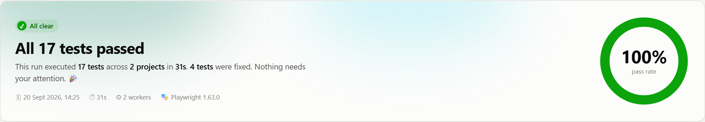
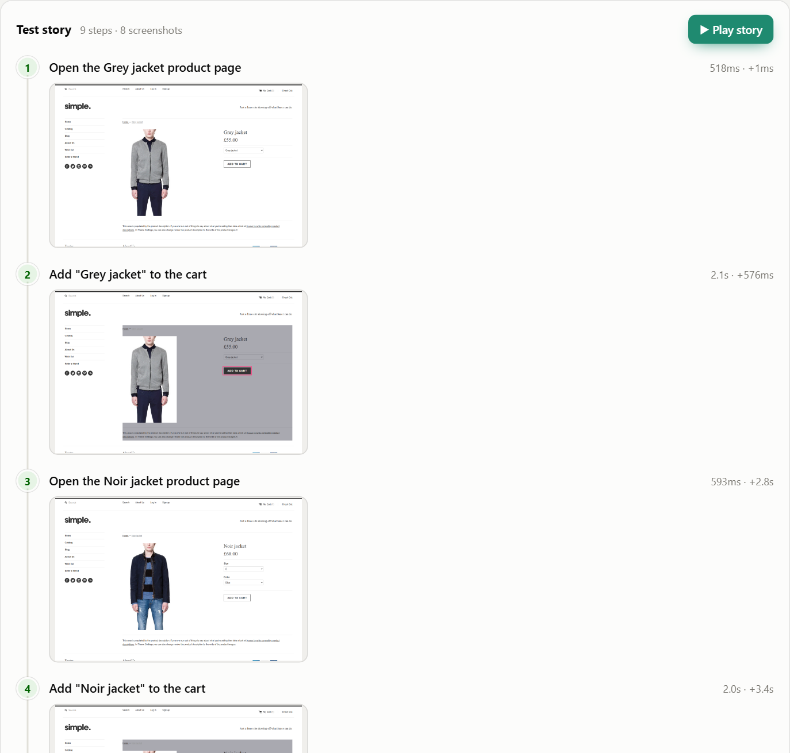
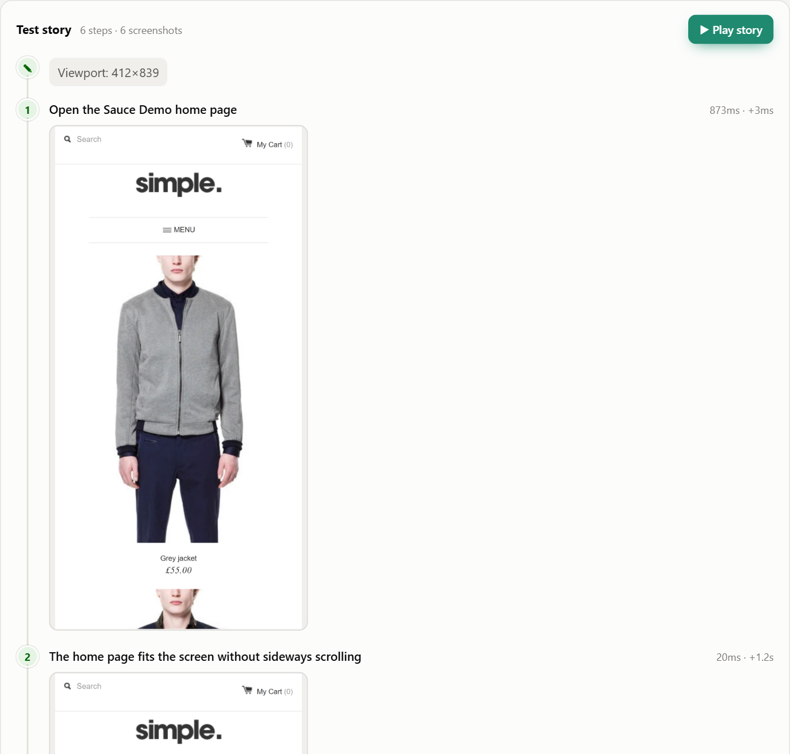
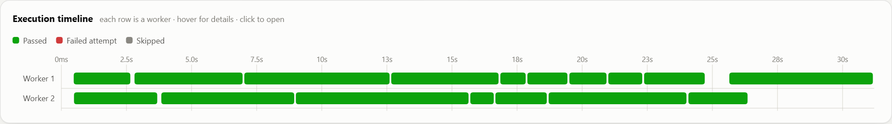

# Sauce Demo — Shopify store automation

End-to-end tests for the public demo shop **[sauce-demo.myshopify.com](https://sauce-demo.myshopify.com)**, written with Playwright and reported with [Aurora Report](https://github.com/chinnu-82/chinnu_report).

**Every test tells a story:** each action a shopper takes becomes a step in the report, with its own screenshot.



---

## Clone and run

You need [Node.js](https://nodejs.org) 18 or newer. Nothing else — the test browser and the report tool are installed by the commands below.

```bash
git clone https://github.com/chinnu-82/sample_code_withReport.git
cd sample_code_withReport
npm install                  # installs Playwright + the bundled Aurora Report
npx playwright install chromium
npx playwright test          # runs all 17 tests against the live demo store
npx aurora-report open       # opens the report for the run that just finished
```

On Windows you can skip all of that and double-click **`run-tests.bat`**, which installs what is missing, runs the tests and opens the report.

Handy variations:

```bash
npm run test:smoke     # the 5 @smoke tests, about 6 seconds
npm run test:mobile    # the emulated Pixel 7 test
npm run test:headed    # watch a real browser do it, one test at a time
npm run report         # reopen the last report
```

> The tests hit the **live** demo shop over the internet, so you need a working connection. A run takes about 30 seconds.

Point the tests at a different store with `BASE_URL`:

```bash
BASE_URL=https://another-shop.myshopify.com npx playwright test     # bash
$env:BASE_URL="https://another-shop.myshopify.com"; npx playwright test   # PowerShell
```

## What is covered

17 tests across 7 files — 16 on Desktop Chrome, 1 on an emulated Pixel 7.

| # | Test | What a shopper does |
|---|---|---|
| 1 | Home shows featured products `@smoke` | Lands on the shop and sees three priced products |
| 2 | Main menu navigation | Visits Catalog, Blog and About Us and comes back |
| 3 | Catalogue lists everything `@smoke` | Browses all 7 products, each priced, sold-out ones labelled |
| 4 | Product card opens product page | Clicks a card and lands on the right product |
| 5 | Search finds products `@smoke` | Searches "jacket" and gets both jackets |
| 6 | Search with no matches | Searches nonsense and is told politely |
| 7 | Product page has what you need `@smoke` | Sees name, price and an enabled Add to Cart |
| 8 | Sold-out product cannot be bought | Finds a disabled "Sold Out" button |
| 9 | Add a jacket to the cart `@smoke` | Adds a product and finds it in the cart at the right price |
| 10 | Total follows the quantity | Changes quantity to 3 and the total triples |
| 11 | Removing the last item | Empties the cart again |
| 12 | Two products side by side | Adds two products; the total is their sum |
| 13 | A filled cart offers checkout | Reaches the Check Out button (no order is placed) |
| 14 | Login form is usable | Finds email, password and Sign In |
| 15 | Wrong credentials | Is not signed in |
| 16 | Unknown address | Gets a 404 page with a way back |
| 17 | Shop on a phone `@responsive` | Browses and adds to the cart at 390px wide |

Run a subset by tag:

```bash
npx playwright test --grep @smoke
npx playwright test --project "Mobile Chrome"
```

## How each test builds its story

Page objects receive Aurora's `report` object, so **the page object records the story** and the test stays readable.

```js
// pages/ProductPage.js
async addToCartAndWait(name) {
  await this.report.step(`Add "${name}" to the cart`, async () => {
    await Promise.all([
      this.page.waitForResponse((r) => r.url().includes('/cart/add.js')),
      this.addToCart.click(),
    ]);
  }, { highlight: this.addToCart });   // outlines the button in the screenshot
}
```

```js
// tests/cart.spec.js
test('two different products are kept side by side and added up', async ({ product, cart, report }) => {
  report.feature('Cart');
  report.severity('high');

  await product.openProduct(first.handle, first.name);
  await product.addToCartAndWait(first.name);
  await product.openProduct(second.handle, second.name);
  await product.addToCartAndWait(second.name);
  await product.expectCartCount(2);

  await product.goToCart();
  await cart.expectContains([first.name, second.name]);
  report.note(`£${first.price} + £${second.price} = £${first.price + second.price}`);
  await cart.expectTotal(first.price + second.price);
});
```

And this is what the report makes of it — nine steps, eight screenshots, with the clicked button highlighted:



The same test on a phone:



What each part of the code produces in the report:

| In the test | In the report |
|---|---|
| `report.step(title, fn)` | A story step with a screenshot |
| `{ highlight: locator }` | Element outlined, rest of the page dimmed |
| `report.note('…')` | A note between the steps |
| `report.attach('Products found', list)` | Foldable data in the story |
| `report.check('…', fn)` | A soft check — one failure doesn't hide the rest |
| `report.feature()` / `severity()` / `owner()` | Badges for filtering and grouping |

## Project layout

```
pages/           page objects — they record the story
  BasePage.js      header, cart counter, menu, money parsing
  CatalogPage.js   home + catalogue grids
  ProductPage.js   product detail and add-to-cart
  CartPage.js      cart lines, quantities, totals, checkout
  SearchPage.js    search and results
  AccountPage.js   customer login
tests/           one spec per area of the shop
fixtures.js      wires the page objects into Playwright fixtures
test-data.js     expected products and prices
aurora.config.js report settings
playwright.config.js  browsers, retries, timeouts, base URL
```

## Notes about this particular store

Things found while writing these tests, which the locators now account for:

- **Add to Cart is a background request.** The theme posts to `/cart/add.js`, so the tests wait for that response instead of a fixed timeout.
- **The header count updates late.** "My Cart (n)" is refreshed after the request finishes, so assertions use auto-retrying `expect`.
- **The theme renders hidden duplicates** of the cart link and the quantity boxes. Every locator picks the visible one.
- **Sold out:** Brown Shades and White sandals cannot be added to the cart.
- **A wrong password shows no error message.** The store just redisplays the login form, so the test asserts the shopper is still signed out rather than inventing an error message that never appears.
- **The cart page has no `<table>`** — lines live in `#cart .row`.

## Being a good guest on someone else's site

This is a public demo store owned by someone else, so the suite:

- runs with **2 workers** and 17 tests, a light load
- **never completes an order** — test 13 stops at the Check Out button
- **never creates an account** — only an obviously invalid login is attempted
- uses no personal data: the only address used is `nobody-does-not-exist@example.com`

If the shop owner changes a price or a product name, tests will fail. That is intended: the report then shows *"expected £55.00 but the app gave …"*, which is exactly the signal you want.

## Troubleshooting

| Problem | Fix |
|---|---|
| `'playwright' is not recognized` | Run `npm install` first, and use `npx playwright test` |
| `browserType.launch: Executable doesn't exist` | Run `npx playwright install chromium` |
| Timeouts on every test | Check your internet connection or proxy; the store is a live site |
| A price or product name assertion fails | The shop owner changed the catalogue — update `test-data.js` |
| `Cannot find module 'aurora-report'` | Run `npm install` in the project root; it is bundled in `vendor/` |
| The report does not open | Open `aurora-report/index.html` by hand, or run `npm run report` |

### About the bundled reporter

Aurora Report is committed to this repo as `vendor/aurora-report-1.0.0.tgz`, so `npm install` works right after cloning with nothing else to set up. To move to a newer version, run `npm pack` in a checkout of [chinnu_report](https://github.com/chinnu-82/chinnu_report), drop the new `.tgz` into `vendor/`, update the version in `package.json` and run `npm install`.

### Continuous integration

`.github/workflows/e2e.yml` runs the suite on every push and pull request, and weekly. The report is uploaded as a build artifact called **aurora-report** — download it, unzip it, and open `index.html`.

## Failed API calls in the report

Any request that fails — HTTP 400 and above, or one that never completes — is recorded with **both sides**: the request that went out (method, URL, headers, payload) and the response that came back (status, headers, body, duration). Open **Browser diagnostics → Failed network requests** on any test and click a row.

Secrets never reach the report: `authorization`, `cookie` and `x-api-key` headers show as `«hidden»`.

A live Shopify store loads a lot of third-party tracking that fails constantly and says nothing about the shop — 72 such entries in an unfiltered run here. `aurora.config.js` narrows that to the store's own traffic:

```js
capture: {
  network: {
    include: ['sauce-demo.myshopify.com'],   // only the store's own requests
    exclude: [                               // and not even all of those
      '**/web-pixels**',
      'monorail-edge.shopifysvc.com',
      /facebook\.com\/tr/,
      'google-analytics.com',
    ],
  },
},
```

That leaves exactly one recorded request across the whole suite: the deliberate 404 from the error-handling test. Patterns can be a substring, a `*` wildcard, a `RegExp`, or a `(url) => boolean` function.

## Every run is kept

Reports are **not** overwritten. Each run is written to its own timestamped folder:

```
aurora-report/
  index.html                  ← list of every run, newest first
  history.json                ← shared, so the trend charts span all runs
  2026-09-20_09-14-02/        ← one run
    index.html                  its report
    results.json                its data
    assets/                     its screenshots, videos and traces
  2026-09-20_11-47-35/        ← the next run, untouched by later ones
```

- Folder names are local time, `YYYY-MM-DD_HH-MM-SS`, so they sort oldest to newest.
- Each folder stands alone — zip one and send it to a colleague.
- The 30 most recent runs are kept; change `keepRuns` in `aurora.config.js` (`0` keeps everything).

```bash
npx aurora-report open          # the newest run
npx aurora-report open --all    # the list of every run
```

To go back to a single overwritten report, set `timestampedRuns: false` in `aurora.config.js`.

## The report

`npx playwright test` writes a report: the run summary, every test story, failure analysis, videos and traces for failures, trends across runs, and the worker timeline.



Tutorial and full options: [Aurora Report docs](https://github.com/chinnu-82/chinnu_report/blob/main/docs/TUTORIAL.md).
